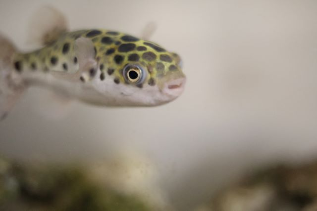
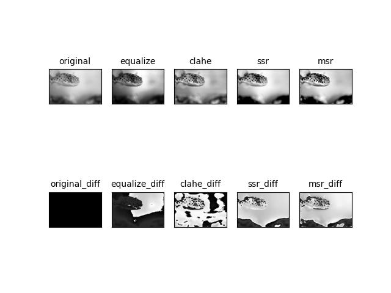

# AdjustGrayScaleBrightness

This code summarizes several processes for adjusting the brightness of a grayscale image.  
It takes a color or grayscale image file as input and processes the brightness adjustment.  

The processes used are as follows For details, please refer to the respective links.
- [equalizeHist](http://labs.eecs.tottori-u.ac.jp/sd/Member/oyamada/OpenCV/html/py_tutorials/py_imgproc/py_histograms/py_histogram_equalization/py_histogram_equalization.html)
- [CLAHE](http://labs.eecs.tottori-u.ac.jp/sd/Member/oyamada/OpenCV/html/py_tutorials/py_imgproc/py_histograms/py_histogram_equalization/py_histogram_equalization.html)
- [Retinex[1]](https://github.com/aravindskrishnan/Retinex-Image-Enhancement), [Retinex[2]](https://santhalakshminarayana.github.io/blog/retinex-image-enhancement)

# Sample images of results
- input  


- result  


The "diff" indicates the difference from the original image.

# How to use
Prepare a python environment (recommended is python 3.11.2) and install the necessary libraries using the following code.  

```
pip install -r requirements.txt
```

Argument the image file whose brightness you wish to adjust, and start the process.

```
python main.py data/sample.jpg
```
